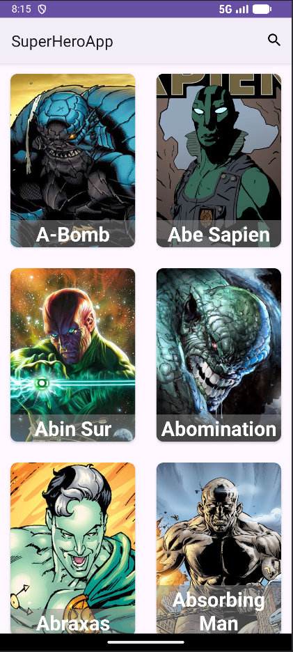
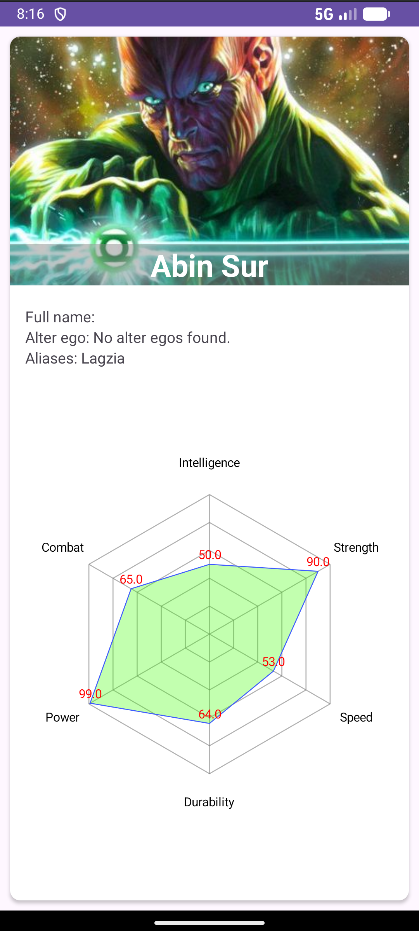
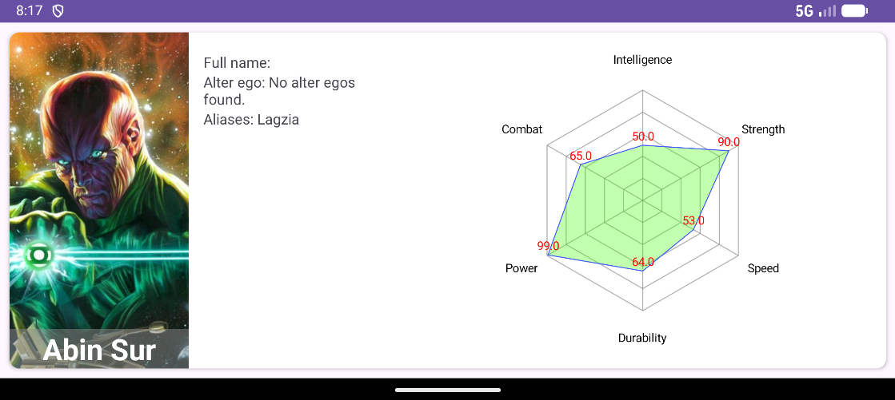

# SuperHeroApp - API-Powered Superhero Browser

Kotlin Android app that fetches superhero data from a public API using Retrofit.

## Features
- Fetch and list superheroes from remote API
- Detail view with name, image, status...
- Radar chart for power distribution
- Landscape orientation support with dedicated layout
- Basic error/loading handling

## Tech Stack
- **Language**: Kotlin
- **Networking**: Retrofit + converter (Gson)
- **UI**: XML layouts + RecycleView
- **Charting**: MPAndroidChart

This app is excellent demonstration of API integration, data parsing and visualization.

## Screenshots

    
    
    

## Setup
1. Clone repo
2. Open in Android Studio
3. Sync Gradle -> Run on emulator/device(min SDK 21)
